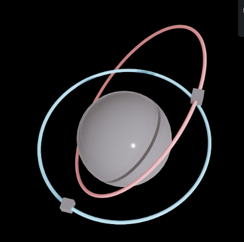

# com.ov.core — Orbit Core Extension

Isaac Sim extension providing two-body orbital mechanics simulation, control primitives, and USD-native state persistence.



## Module layout

```
com.ov.core/
├── extension.py        # IExt lifecycle, per-frame update loop, USD transform writes
├── service.py          # OrbitService singleton, OrbitBody dataclass
├── orbit_math.py       # TwoBodyRK4, FixedStepClock, vector math, COE conversion
└── usd_persistence.py  # orbit: namespace attribute read/write/scan
```

---

## Simulation model

Each registered `OrbitBody` integrates the two-body EOM in the **attractor-relative frame** using 4th-order Runge-Kutta. World position applied to the USD prim each frame:

```
world_pos = attractor_world_pos + body.r
```

`FixedStepClock` accumulates wall-clock `dt_frame` and fires an integer number of fixed sub-steps per frame, decoupling sim frequency from render rate.

**State is always attractor-relative.** The attractor prim is passive — it is never registered unless it also orbits something else.

---

## USD persistence

Body state is stored as custom attributes in the `orbit:` namespace directly on the body prim. No external database.

| Attribute | Type | Description |
|---|---|---|
| `orbit:attractor_path` | string | USD path of attractor prim |
| `orbit:mu` | double | Gravitational parameter |
| `orbit:dt_sim` | double | Fixed integration timestep (s) |
| `orbit:r` | double3 | Position relative to attractor |
| `orbit:v` | double3 | Velocity relative to attractor |
| `orbit:control_mode` | string | `"free"` \| `"dock"` \| `"pd"` |
| `orbit:target_offset` | double3 | Dock / PD target (attractor-relative) |
| `orbit:kp` | double | PD proportional gain |
| `orbit:kd` | double | PD derivative gain |
| `orbit:a_max` | double | Thrust clamp magnitude (0 = unlimited) |
| `orbit:enabled` | bool | Whether body is simulated |

State saves automatically with `.usd`. On stage open, `restore_from_stage()` walks all prims and reconstructs any body carrying `orbit:attractor_path`.

**Not persisted:** `_pre_dock_r` / `_pre_dock_v` (pre-dock orbital state). Undocking after a reload resumes from the docked position with zero velocity.

---

## Stage lifecycle

`OrbitCoreExtension` subscribes to stage events:

- **OPENED** → `restore_from_stage(stage)` — reconstructs all bodies from USD attributes
- **CLOSED** → `clear_stage()` + `reset()` — clears all bodies and stage reference

The update loop (`_on_update`) guards against a `None` stage and runs a one-time flush when `_stage` transitions from `None`, writing any in-memory bodies that were added before the stage was available.

---

## Installation

1. Add to Isaac Sim Extension Manager:
   ```
   <repo>/exts
   ```
2. Enable `com.ov.core`. This extension has no declared extension dependencies beyond the Isaac Sim runtime (`omni.usd`, `omni.kit.app`, `omni.timeline`).

Load `com.ov.core` **before** `com.ov.controls`. When reloading both, disable in reverse order (controls first), then re-enable core first.

---

## API

### `get_orbit_service() -> OrbitService`

Returns the module-level singleton. Import from `com.ov.core.service`:

```python
from com.ov.core.service import get_orbit_service
svc = get_orbit_service()
```

The singleton persists across extension reloads. To force a clean state (e.g. during development):

```python
import com.ov.core.service as m
m._SERVICE = None
```

---

### `OrbitService`

#### Body registration

```python
svc.add_body_circular(
    prim_path,       # str  — USD path of orbiting prim
    attractor_path,  # str  — USD path of attractor prim
    mu,              # float
    dt_sim,          # float — integration timestep (s)
    radius,          # float — circular orbit radius
    plane,           # str  — "xy" | "xz" | "yz"
) -> OrbitBody
```

```python
svc.add_body_elements(
    prim_path, attractor_path, mu, dt_sim,
    a,         # semi-major axis
    e,         # eccentricity (0 ≤ e < 1)
    inc_deg,   # inclination (degrees)
    raan_deg,  # RAAN (degrees)
    argp_deg,  # argument of periapsis (degrees)
    nu_deg,    # true anomaly at epoch (degrees)
) -> OrbitBody
```

```python
svc.remove_body(prim_path)   # removes body + erases orbit: attrs from prim
svc.list_bodies() -> List[str]
svc.get_body(prim_path) -> Optional[OrbitBody]
```

#### Control primitives

```python
svc.apply_impulse(prim_path, dv: Vec3)
# Instantaneous Δv: b.v += dv

svc.set_dock(prim_path, offset: Vec3)
# Saves pre-dock (r, v), then snaps body to offset every tick with v=(0,0,0)

svc.clear_dock(prim_path)
# Restores pre-dock (r, v), returns to free flight

svc.set_pd_hold(prim_path, target_offset: Vec3, kp, kd, a_max=0.0)
# PD station-keeping: a = kp*(target-r) + kd*(0-v), clamped to a_max

svc.clear_pd(prim_path)
# Returns body to free flight
```

#### Stage / lifecycle

```python
svc.set_stage(stage)
svc.clear_stage()
svc.restore_from_stage(stage) -> int   # returns number of bodies restored
svc.reset()                            # clears all bodies and step counters
```

#### Internal

```python
svc.step_body(prim_path, dt_frame)
# Called by extension._on_update. Advances clock, runs RK4/dock/PD, writes USD every 30 steps.

svc._write(body)
# Calls write_body_to_prim; no-op if _stage is None.
```

---

### `OrbitBody` fields

```python
@dataclass
class OrbitBody:
    prim_path: str
    attractor_path: str
    mu: float
    dt_sim: float
    r: Vec3               # position relative to attractor
    v: Vec3               # velocity relative to attractor
    control_mode: str     # "free" | "dock" | "pd"
    target_offset: Vec3   # dock snap point or PD setpoint (attractor-relative)
    kp: float
    kd: float
    a_max: float          # thrust magnitude clamp; 0 = unlimited
    enabled: bool
    _clock: FixedStepClock
    _dyn: TwoBodyRK4
    # runtime only, not persisted:
    # _pre_dock_r, _pre_dock_v  — set by set_dock(), consumed by clear_dock()
```

---

### `orbit_math` module

```python
Vec3 = Tuple[float, float, float]

v_add(a, b) -> Vec3
v_sub(a, b) -> Vec3
v_mul(s, a) -> Vec3
v_norm(a)   -> float

circular_orbit_ic(mu, radius, plane) -> (r0: Vec3, v0: Vec3)
coe_to_rv(mu, a, e, inc_rad, raan_rad, argp_rad, nu_rad) -> (r: Vec3, v: Vec3)

class TwoBodyRK4:
    mu: float
    center: Vec3                    # gravity center (default origin)
    rk4_step(r, v, dt, a_cmd=(0,0,0)) -> (r_next, v_next)

class FixedStepClock:
    dt_sim: float
    steps(dt_frame: float) -> int   # number of sim ticks to run this frame
```

---

### `usd_persistence` module

```python
write_body_to_prim(stage, body) -> bool
# Writes all orbit: attrs in a single Sdf.ChangeBlock. Returns False if prim not found.

erase_body_from_prim(stage, prim_path)
# Removes all orbit: attrs. Called by remove_body().

read_body_from_prim(stage, prim_path) -> Optional[dict]
# Returns kwarg dict for OrbitBody reconstruction, or None if no orbit: attrs present.

scan_stage_for_bodies(stage) -> List[dict]
# Traverses all prims, returns list of read_body_from_prim dicts. Skips /OrbitViz.
```

---

## Known issues

- `_pre_dock_r` / `_pre_dock_v` are not written to USD. A dock → save → reload → undock sequence resumes from the docked position with zero velocity rather than the pre-dock orbit.
- `_update_sub` unsubscribe in `on_shutdown` has the `= None` line commented out — intentional (Omniverse handles cleanup), but worth noting.
- USD write frequency: every 30 sim steps + once at end of each frame. High `dt_sim` values (large steps) write more frequently in wall-clock time.